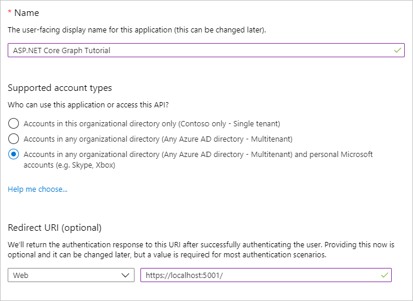

# <a name="how-to-run-the-completed-project"></a><span data-ttu-id="03081-101">Como executar o projeto concluído</span><span class="sxs-lookup"><span data-stu-id="03081-101">How to run the completed project</span></span>

## <a name="prerequisites"></a><span data-ttu-id="03081-102">Pré-requisitos</span><span class="sxs-lookup"><span data-stu-id="03081-102">Prerequisites</span></span>

<span data-ttu-id="03081-103">Para executar o projeto concluído nessa pasta, você precisará do seguinte:</span><span class="sxs-lookup"><span data-stu-id="03081-103">To run the completed project in this folder, you need the following:</span></span>

- <span data-ttu-id="03081-104">O [SDK do .NET Core](https://dotnet.microsoft.com/download) instalado em sua máquina de desenvolvimento.</span><span class="sxs-lookup"><span data-stu-id="03081-104">The [.NET Core SDK](https://dotnet.microsoft.com/download) installed on your development machine.</span></span> <span data-ttu-id="03081-105">( **Observação:** este tutorial foi escrito com o .NET Core SDK versão 3.1.201.</span><span class="sxs-lookup"><span data-stu-id="03081-105">( **Note:** This tutorial was written with .NET Core SDK version 3.1.201.</span></span> <span data-ttu-id="03081-106">As etapas deste guia podem funcionar com outras versões, mas que não foram testadas.</span><span class="sxs-lookup"><span data-stu-id="03081-106">The steps in this guide may work with other versions, but that has not been tested.)</span></span>
- <span data-ttu-id="03081-107">Uma conta pessoal da Microsoft com uma caixa de correio no Outlook.com ou uma conta corporativa ou de estudante da Microsoft.</span><span class="sxs-lookup"><span data-stu-id="03081-107">Either a personal Microsoft account with a mailbox on Outlook.com, or a Microsoft work or school account.</span></span>

<span data-ttu-id="03081-108">Se você não tem uma conta da Microsoft, há algumas opções para obter uma conta gratuita:</span><span class="sxs-lookup"><span data-stu-id="03081-108">If you don't have a Microsoft account, there are a couple of options to get a free account:</span></span>

- <span data-ttu-id="03081-109">Você pode [se inscrever para uma nova conta pessoal da Microsoft](https://signup.live.com/signup?wa=wsignin1.0&rpsnv=12&ct=1454618383&rver=6.4.6456.0&wp=MBI_SSL_SHARED&wreply=https://mail.live.com/default.aspx&id=64855&cbcxt=mai&bk=1454618383&uiflavor=web&uaid=b213a65b4fdc484382b6622b3ecaa547&mkt=E-US&lc=1033&lic=1).</span><span class="sxs-lookup"><span data-stu-id="03081-109">You can [sign up for a new personal Microsoft account](https://signup.live.com/signup?wa=wsignin1.0&rpsnv=12&ct=1454618383&rver=6.4.6456.0&wp=MBI_SSL_SHARED&wreply=https://mail.live.com/default.aspx&id=64855&cbcxt=mai&bk=1454618383&uiflavor=web&uaid=b213a65b4fdc484382b6622b3ecaa547&mkt=E-US&lc=1033&lic=1).</span></span>
- <span data-ttu-id="03081-110">Você pode [se inscrever no programa para desenvolvedores do office 365](https://developer.microsoft.com/office/dev-program) para obter uma assinatura gratuita do Office 365.</span><span class="sxs-lookup"><span data-stu-id="03081-110">You can [sign up for the Office 365 Developer Program](https://developer.microsoft.com/office/dev-program) to get a free Office 365 subscription.</span></span>

## <a name="register-a-web-application-with-the-azure-active-directory-admin-center"></a><span data-ttu-id="03081-111">Registrar um aplicativo Web com o centro de administração do Azure Active Directory</span><span class="sxs-lookup"><span data-stu-id="03081-111">Register a web application with the Azure Active Directory admin center</span></span>

1. <span data-ttu-id="03081-112">Abra um navegador e navegue até o [centro de administração do Azure Active Directory](https://aad.portal.azure.com).</span><span class="sxs-lookup"><span data-stu-id="03081-112">Open a browser and navigate to the [Azure Active Directory admin center](https://aad.portal.azure.com).</span></span> <span data-ttu-id="03081-113">Faça logon usando uma **conta pessoal** (também conhecida como Conta da Microsoft) ou **Conta Corporativa ou de Estudante**.</span><span class="sxs-lookup"><span data-stu-id="03081-113">Login using a **personal account** (aka: Microsoft Account) or **Work or School Account**.</span></span>

1. <span data-ttu-id="03081-114">Selecione **Azure Active Directory** na navegação esquerda e selecione **Registros de aplicativos** em **Gerenciar**.</span><span class="sxs-lookup"><span data-stu-id="03081-114">Select **Azure Active Directory** in the left-hand navigation, then select **App registrations** under **Manage**.</span></span>

    

1. <span data-ttu-id="03081-116">Selecione **Novo registro**.</span><span class="sxs-lookup"><span data-stu-id="03081-116">Select **New registration**.</span></span> <span data-ttu-id="03081-117">Na página **Registrar um aplicativo** , defina os valores da seguinte forma.</span><span class="sxs-lookup"><span data-stu-id="03081-117">On the **Register an application** page, set the values as follows.</span></span>

    - <span data-ttu-id="03081-118">Defina **Nome** para `ASP.NET Core Graph Tutorial`.</span><span class="sxs-lookup"><span data-stu-id="03081-118">Set **Name** to `ASP.NET Core Graph Tutorial`.</span></span>
    - <span data-ttu-id="03081-119">Defina **Tipos de conta com suporte** para **Contas em qualquer diretório organizacional e contas pessoais da Microsoft**.</span><span class="sxs-lookup"><span data-stu-id="03081-119">Set **Supported account types** to **Accounts in any organizational directory and personal Microsoft accounts**.</span></span>
    - <span data-ttu-id="03081-120">Em **URI de Redirecionamento** , defina o primeiro menu suspenso para `Web` e defina o valor como `https://localhost:5001/`.</span><span class="sxs-lookup"><span data-stu-id="03081-120">Under **Redirect URI** , set the first drop-down to `Web` and set the value to `https://localhost:5001/`.</span></span>

    

1. <span data-ttu-id="03081-122">Selecione **Registrar**.</span><span class="sxs-lookup"><span data-stu-id="03081-122">Select **Register**.</span></span> <span data-ttu-id="03081-123">Na página de **tutorial do gráfico principal do ASP.net** , copie o valor da ID do **aplicativo (cliente)** e salve-o, você precisará dele na próxima etapa.</span><span class="sxs-lookup"><span data-stu-id="03081-123">On the **ASP.NET Core Graph Tutorial** page, copy the value of the **Application (client) ID** and save it, you will need it in the next step.</span></span>

    

1. <span data-ttu-id="03081-125">Selecione **Autenticação** em **Gerenciar**.</span><span class="sxs-lookup"><span data-stu-id="03081-125">Select **Authentication** under **Manage**.</span></span> <span data-ttu-id="03081-126">Em **URIs de redirecionamento** , adicione um URI com o valor `https://localhost:5001/signin-oidc` .</span><span class="sxs-lookup"><span data-stu-id="03081-126">Under **Redirect URIs** add a URI with the value `https://localhost:5001/signin-oidc`.</span></span>

1. <span data-ttu-id="03081-127">Definir a **URL de logout** como `https://localhost:5001/signout-oidc` .</span><span class="sxs-lookup"><span data-stu-id="03081-127">Set the **Logout URL** to `https://localhost:5001/signout-oidc`.</span></span>

1. <span data-ttu-id="03081-128">Localize a seção **Concessão Implícita** e habilite **tokens de ID**.</span><span class="sxs-lookup"><span data-stu-id="03081-128">Locate the **Implicit grant** section and enable **ID tokens**.</span></span> <span data-ttu-id="03081-129">Selecione **Salvar**.</span><span class="sxs-lookup"><span data-stu-id="03081-129">Select **Save**.</span></span>

    

1. <span data-ttu-id="03081-131">Selecione **Certificados e segredos** sob **Gerenciar**.</span><span class="sxs-lookup"><span data-stu-id="03081-131">Select **Certificates & secrets** under **Manage**.</span></span> <span data-ttu-id="03081-132">Selecione o botão **Novo segredo do cliente**.</span><span class="sxs-lookup"><span data-stu-id="03081-132">Select the **New client secret** button.</span></span> <span data-ttu-id="03081-133">Insira um valor em **Descrição** e selecione uma das opções para **expirar** e selecione **Adicionar**.</span><span class="sxs-lookup"><span data-stu-id="03081-133">Enter a value in **Description** and select one of the options for **Expires** and select **Add**.</span></span>

    

1. <span data-ttu-id="03081-135">Copie o valor secreto do cliente antes de sair desta página.</span><span class="sxs-lookup"><span data-stu-id="03081-135">Copy the client secret value before you leave this page.</span></span> <span data-ttu-id="03081-136">Você precisará dele na próxima etapa.</span><span class="sxs-lookup"><span data-stu-id="03081-136">You will need it in the next step.</span></span>

    > [!IMPORTANT]
    > <span data-ttu-id="03081-137">Este segredo do cliente nunca é mostrado novamente, portanto, copie-o agora.</span><span class="sxs-lookup"><span data-stu-id="03081-137">This client secret is never shown again, so make sure you copy it now.</span></span>

    

## <a name="configure-the-sample"></a><span data-ttu-id="03081-139">Configurar o exemplo</span><span class="sxs-lookup"><span data-stu-id="03081-139">Configure the sample</span></span>

1. <span data-ttu-id="03081-140">Abra a interface de linha de comando (CLI) no diretório onde o **GraphTutorial. csproj** está localizado e execute os seguintes comandos, substituindo `YOUR_APP_ID` pela ID do aplicativo do portal do Azure e `YOUR_APP_SECRET` com o segredo do aplicativo.</span><span class="sxs-lookup"><span data-stu-id="03081-140">Open your command line interface (CLI) in the directory where **GraphTutorial.csproj** is located, and run the following commands, substituting `YOUR_APP_ID` with your application ID from the Azure portal, and `YOUR_APP_SECRET` with your application secret.</span></span>

    ```Shell
    dotnet user-secrets init
    dotnet user-secrets set "AzureAd:ClientId" "YOUR_APP_ID"
    dotnet user-secrets set "AzureAd:ClientSecret" "YOUR_APP_SECRET"
    ```

## <a name="run-the-sample"></a><span data-ttu-id="03081-141">Executar o exemplo</span><span class="sxs-lookup"><span data-stu-id="03081-141">Run the sample</span></span>

<span data-ttu-id="03081-142">Na sua CLI, execute o seguinte comando para iniciar o aplicativo.</span><span class="sxs-lookup"><span data-stu-id="03081-142">In your CLI, run the following command to start the application.</span></span>

```Shell
dotnet run
```
