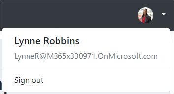

<!-- markdownlint-disable MD002 MD041 -->

Neste exercício, você estenderá o aplicativo do exercício anterior para oferecer suporte à autenticação com o Azure AD. Isso é necessário para obter o token de acesso OAuth necessário para chamar a API do Microsoft Graph. Nesta etapa, você irá configurar a biblioteca [Microsoft. Identity. Web](https://www.nuget.org/packages/Microsoft.Identity.Web/) .

> [!IMPORTANT]
> Para evitar o armazenamento da ID do aplicativo e o segredo na fonte, você usará o [Gerenciador de segredo do .net](/aspnet/core/security/app-secrets) para armazenar esses valores. O gerente secreto é apenas para fins de desenvolvimento, os aplicativos de produção devem usar um Gerenciador de segredo confiável para armazenar segredos.

1. Abra **./appsettings.jsem** e substitua seu conteúdo pelo seguinte.

    :::code language="json" source="../demo/GraphTutorial/appsettings.json" highlight="2-6":::

1. Abra a CLI no diretório onde o **GraphTutorial. csproj** está localizado e execute os seguintes comandos, substituindo `YOUR_APP_ID` pela ID do aplicativo do portal do Azure e `YOUR_APP_SECRET` com o segredo do aplicativo.

    ```Shell
    dotnet user-secrets init
    dotnet user-secrets set "AzureAd:ClientId" "YOUR_APP_ID"
    dotnet user-secrets set "AzureAd:ClientSecret" "YOUR_APP_SECRET"
    ```

## <a name="implement-sign-in"></a>Implementar logon

Comece adicionando os serviços da plataforma de identidade da Microsoft ao aplicativo.

1. Crie um novo arquivo chamado **GraphConstants.cs** no diretório **./Graph** e adicione o código a seguir.

    :::code language="csharp" source="../demo/GraphTutorial/Graph/GraphConstants.cs" id="GraphConstantsSnippet":::

1. Abra o arquivo **./Startup.cs** e adicione as seguintes `using` instruções à parte superior do arquivo.

    ```csharp
    using Microsoft.AspNetCore.Authentication.OpenIdConnect;
    using Microsoft.AspNetCore.Authorization;
    using Microsoft.AspNetCore.Mvc.Authorization;
    using Microsoft.Identity.Web;
    using Microsoft.Identity.Web.UI;
    using Microsoft.IdentityModel.Protocols.OpenIdConnect;
    using Microsoft.Graph;
    using System.Net;
    using System.Net.Http.Headers;
    ```

1. Substitua a função `ConfigureServices` existente pelo seguinte.

    ```csharp
    public void ConfigureServices(IServiceCollection services)
    {
        services
            // Use OpenId authentication
            .AddAuthentication(OpenIdConnectDefaults.AuthenticationScheme)
            // Specify this is a web app and needs auth code flow
            .AddMicrosoftIdentityWebApp(Configuration)
            // Add ability to call web API (Graph)
            // and get access tokens
            .EnableTokenAcquisitionToCallDownstreamApi(options => {
                Configuration.Bind("AzureAd", options);
            }, GraphConstants.Scopes)
            // Use in-memory token cache
            // See https://github.com/AzureAD/microsoft-identity-web/wiki/token-cache-serialization
            .AddInMemoryTokenCaches();

        // Require authentication
        services.AddControllersWithViews(options =>
        {
            var policy = new AuthorizationPolicyBuilder()
                .RequireAuthenticatedUser()
                .Build();
            options.Filters.Add(new AuthorizeFilter(policy));
        })
        // Add the Microsoft Identity UI pages for signin/out
        .AddMicrosoftIdentityUI();
    }
    ```

1. Na `Configure` função, adicione a linha a seguir acima da `app.UseAuthorization();` linha.

    ```csharp
    app.UseAuthentication();
    ```

1. Abra **./Controllers/HomeController.cs** e substitua seu conteúdo pelo seguinte.

    ```csharp
    using GraphTutorial.Models;
    using Microsoft.AspNetCore.Authorization;
    using Microsoft.AspNetCore.Mvc;
    using Microsoft.Extensions.Logging;
    using Microsoft.Identity.Web;
    using System.Diagnostics;
    using System.Threading.Tasks;

    namespace GraphTutorial.Controllers
    {
        public class HomeController : Controller
        {
            ITokenAcquisition _tokenAcquisition;
            private readonly ILogger<HomeController> _logger;

            // Get the ITokenAcquisition interface via
            // dependency injection
            public HomeController(
                ITokenAcquisition tokenAcquisition,
                ILogger<HomeController> logger)
            {
                _tokenAcquisition = tokenAcquisition;
                _logger = logger;
            }

            public async Task<IActionResult> Index()
            {
                // TEMPORARY
                // Get the token and display it
                try
                {
                    string token = await _tokenAcquisition
                        .GetAccessTokenForUserAsync(GraphConstants.Scopes);
                    return View().WithInfo("Token acquired", token);
                }
                catch (MicrosoftIdentityWebChallengeUserException)
                {
                    return Challenge();
                }
            }

            public IActionResult Privacy()
            {
                return View();
            }

            [ResponseCache(Duration = 0, Location = ResponseCacheLocation.None, NoStore = true)]
            public IActionResult Error()
            {
                return View(new ErrorViewModel { RequestId = Activity.Current?.Id ?? HttpContext.TraceIdentifier });
            }

            [ResponseCache(Duration = 0, Location = ResponseCacheLocation.None, NoStore = true)]
            [AllowAnonymous]
            public IActionResult ErrorWithMessage(string message, string debug)
            {
                return View("Index").WithError(message, debug);
            }
        }
    }
    ```

1. Salve suas alterações e inicie o projeto. Faça logon com sua conta da Microsoft.

1. Examine o prompt de consentimento. A lista de permissões corresponde à lista de escopos de permissões configurados em **./Graph/GraphConstants.cs**.

    - **Manter acesso aos dados para os quais você concedeu acesso a:** ( `offline_access` ) essa permissão é solicitada pelo MSAL para recuperar Tokens de atualização.
    - **Entre e leia seu perfil:** ( `User.Read` ) essa permissão permite que o aplicativo obtenha o perfil do usuário conectado e a foto do perfil.
    - **Leia suas configurações de caixa de correio:** ( `MailboxSettings.Read` ) essa permissão permite que o aplicativo Leia as configurações da caixa de correio do usuário, incluindo o fuso horário e o formato de hora.
    - **Ter acesso total aos seus calendários:** ( `Calendars.ReadWrite` ) essa permissão permite que o aplicativo Leia eventos no calendário do usuário, adicione novos eventos e modifique os existentes.

    

    Para obter mais informações sobre o consentimento, consulte [Understanding Azure ad Application consente experiências](/azure/active-directory/develop/application-consent-experience).

1. Consentimento para as permissões solicitadas. O navegador redireciona para o aplicativo, mostrando o token.

### <a name="get-user-details"></a>Obter detalhes do usuário

Depois que o usuário estiver conectado, você pode obter as informações do Microsoft Graph.

1. Abra **./Graph/GraphClaimsPrincipalExtensions.cs** e substitua todo o conteúdo pelo seguinte.

    :::code language="csharp" source="../demo/GraphTutorial/Graph/GraphClaimsPrincipalExtensions.cs" id="GraphClaimsExtensionsSnippet":::

1. Abra **./Startup.cs** e substitua a `.AddMicrosoftIdentityWebApp(Configuration)` linha existente pelo código a seguir.

    :::code language="csharp" source="../demo/GraphTutorial/Startup.cs" id="AddSignInSnippet":::

    Considere o que esse código faz.

    - Ele adiciona um manipulador de eventos para o `OnTokenValidated` evento.
        - Ele usa a `ITokenAcquisition` interface para obter um token de acesso.
        - Ele chama o Microsoft Graph para obter o perfil e a foto do usuário.
        - Ele adiciona as informações do gráfico à identidade do usuário.

1. Adicione a seguinte chamada de função após a `EnableTokenAcquisitionToCallDownstreamApi` chamada e antes da `AddInMemoryTokenCaches` chamada.

    :::code language="csharp" source="../demo/GraphTutorial/Startup.cs" id="AddGraphClientSnippet":::

    Isso fará com que um **GraphServiceClient** autenticado esteja disponível para os controladores via injeção de dependência.

1. Abra **./Controllers/HomeController.cs** e substitua a `Index` função com o seguinte.

    ```csharp
    public IActionResult Index()
    {
        return View();
    }
    ```

1. Remova todas as referências para `ITokenAcquisition` na classe **HomeController** .

1. Salve suas alterações, inicie o aplicativo e execute o processo de entrada. Você deve terminar de volta na Home Page, mas a interface do usuário deve ser alterada para indicar que você está conectado.

    

1. Clique no avatar do usuário no canto superior direito para **acessar o link sair.** Clicar **em sair** redefine a sessão e retorna à Home Page.

    

## <a name="storing-and-refreshing-tokens"></a>Armazenar e atualizar tokens

Nesse ponto, seu aplicativo tem um token de acesso, que é enviado no `Authorization` cabeçalho das chamadas de API. Este é o token que permite ao aplicativo acessar o Microsoft Graph em nome do usuário.

No entanto, esse token é de vida curta. O token expira uma hora após sua emissão. É onde o token de atualização se torna útil. O token de atualização permite que o aplicativo solicite um novo token de acesso sem exigir que o usuário entre novamente.

Como o aplicativo está usando a biblioteca Microsoft. Identity. Web, você não precisa implementar qualquer lógica de armazenamento ou de atualização.

O aplicativo usa o cache de token na memória, o que é suficiente para aplicativos que não precisam persistir tokens quando o aplicativo é reiniciado. Em vez disso, os aplicativos de produção podem usar as [Opções de cache distribuído](https://github.com/AzureAD/microsoft-identity-web/wiki/token-cache-serialization) na biblioteca Microsoft. Identity. Web.

O `GetAccessTokenForUserAsync` método manipula a expiração do token e a atualização para você. Primeiro ele verifica o token em cache e, se ele não tiver expirado, ele o retornará. Se ele tiver expirado, ele usará o token de atualização em cache para obter um novo.

O **GraphServiceClient** que os controladores recebem por meio da injeção de dependência será pré-configurado com um provedor de autenticação que usa `GetAccessTokenForUserAsync` para você.
